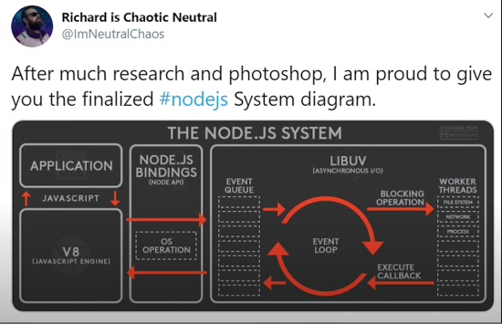
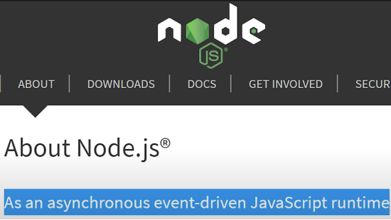

# Node.js

## Node.js Ultimate Beginner's Guide in 7 Easy 🧍

### Fireship.io

[Fireship.io - learn Node](https://fireship.io/courses/javascript/node-basics/)

### Step 1 - What is Node?

Node is a runtime that allows you to run JavaScript on the server. Learn more in the [Fireship.io - now JavaScript works](https://fireship.io/courses/javascript/intro-how-js-works/) section of this course.

### Step 2a - Install Node Version Manager (NVM)

Mac/Linux
NVM for[ Mac & Linux](https://github.com/nvm-sh/nvm).

Windows
NVM for [Windows](https://github.com/coreybutler/nvm-windows).

### Step 2b - Install Node

Use Node Version Manager (NVM) to manage your installation. Install the latest **Long-Term Support (LTS)** version, `nvm install --lts`.

Find out if Node is installed on your system by running `node -v` on the command line.

### Step 3 - Hello World

For trying out basic Node, you can use its REPL (Read Eval Print Loop)

**>_command line**
`node`

**>_command line Node REPL**
`console.log('hello world')`
`>_ hello world` prints in the terminal.

Use **ctrl+c** to shut it down.

For anything more that testing basics, create a JavaScript file.

In code editor, create a file called **index.js** (default entry point for NodeJS files) and code the following:

```javascript
// index.js
console.log("Hello World");
```

Run it with `node`.

```bash
node index.js
# OR
node . # points to index.js
```

### Step 4 - Builtins & Globals

Node has sever global variables that you should know about:

- `global` namespace available througout Node process. Use it to save global variables throughout the app. Similar to `window` in the browser.
- `process` interact with the current Node process to **access** information like the OS platform or environment variables.

### Step 5 - Events and Emitters

Node.js System Diagram





In most cases you will find yourself listening to events and handling them with callbacks, but you can create your won events with an `EventEmitter`.

```javascript
// Step 5 - Events && Emitters
// create
const { EventEmitter } = require("events");
const eventEmitter = new EventEmitter();

// handle
eventEmitter.on("lunch", () => {
  console.log("yum &#x1F32D;");
});

// emit
eventEmitter.emit("lunch");
eventEmitter.emit("lunch");
// yum &#x1F32D;
// yum &#x1F32D;
```

### Step 6 - Work with the File System

Many APIs in Node are callback based.

Setup external text file called 'hello.txt' in the same directory as index.js

```text
Just Hello!!!
```

```javascript
// Step 6 - Work with the File System
const { readFileSync } = require("fs");

// Blocking - (utf-8 is the encoding type)
const txtBlock = readFileSync("./hello.txt", "utf-8");
console.log("1", txtBlock);

// Non-blocking
let { readFile } = require("fs").promises;
// readFile("./hello.txt", "utf8", (err, txt) => {
//   if (err === null) {
//     console.log("2", txt);
//   } else {
//     console.log("err", err);
//   }
// });

// with promises - also, non-blocking
async function HelloWorld() {
  try {
    var promiseTxt = await readFile("./hello.txt", "utf-8");
    console.log(promiseTxt);
  } catch (e) {
    console.log("err", e);
  }
}

HelloWorld();

console.log("Do this ASAP");

// const promiseTxtAsync = await readFile('./hello.txt', 'utf-8'); // Node 14+
```

In version 14.3+ of Node this 'top-level await' will work
but in lower Node versions, 'await' must be inside 'async func'
`var file = await readFile('hello.txt', 'utf-8');`
console.log(file);
wrap in parens them follow with parens to create IIFE
(immediately invoked function expression... self executes!)

### Step 7 - Modules and NPM

Setup an external module in the same directory as index.js

Create a module which is a file that exports its code so it can be imported and used elsewhere

```javascript
// file: my-module.js
module.exports = {
  hello: 'Just Hello';
}
```

```javascript
// Step 7 - Modules and NPM
const { hello } = require("./my-module.js");
console.log(hello);
console.log(hello);
console.log(hello);
```

#### Use Express to create a HTTP endpoint

Create a HTML file:

```html
<!DOCTYPE html>
<html lang="en">
  <head>
    <meta charset="UTF-8" />
    <meta name="viewport" content="width=device-width, initial-scale=1.0" />
    <title>Express App</title>
  </head>
  <body>
    <h1>This is my first node web app!</h1>
  </body>
</html>
```

1. Use [express](https://expressjs.com) to build a HTTP endpoint
1. Read the HTML file
1. Send it back to the client

```javascript
// Step 7 - Modules and NPM
const { hello } = require("./my-module.js");
console.log(hello);
console.log(hello);
console.log(hello);

const express = require("express");
const app = express();
const { readFile } = require("fs").promises;

app.get("/", async (req, res) => {
  res.send(
    await readFile("./app.html", "utf-8", (err, html) => {
      if (err) {
        res.status(500).send("sorry, out of order");
      }

      res.send(html);
    }),
  );
});

app.listen(process.env.PORT || 3000, () =>
  console.log(`App available on http://localhost:3000`),
);
```

#### Deploy App to Google Cloud Engine

Create a Google Cloud account and install the [gcloud SDK](https://cloud.google.com/sdk).

Configure your server.

```yaml
runtime: nodejs12
```

Deploy it!!!

```bash
gcloud app deploy
```
